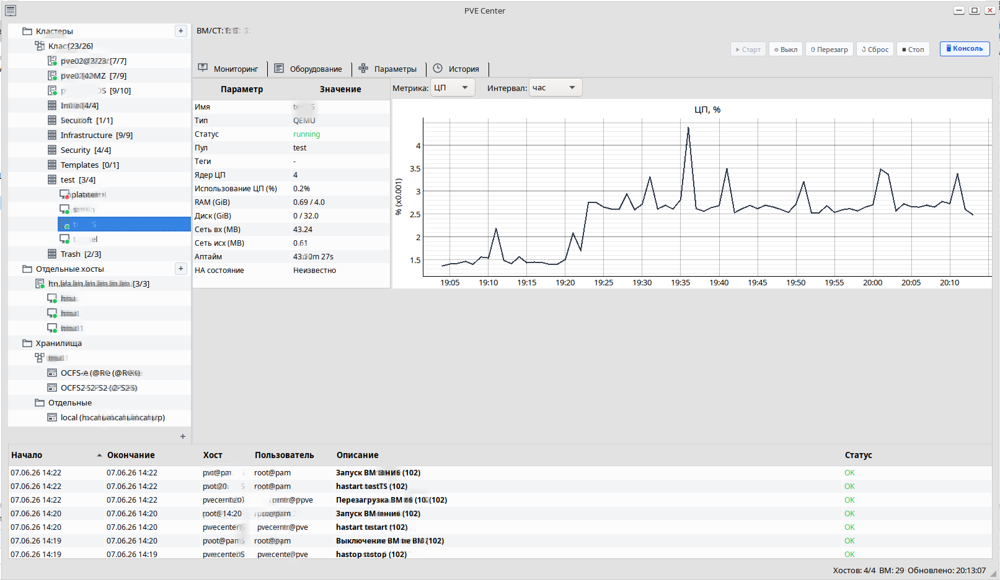

# PVE Center

Desktop client for Proxmox VE management. Written in Python with PySide6.

Monitor clusters and hosts, manage virtual machines and containers, view task history — all in one window, no browser needed.



## Download

| Platform | Format | Link |
|----------|--------|------|
| Windows | .zip | [Releases](https://github.com/mcluremail/pvecenter/releases) |
| Linux (any) | pip | `pip install pvecenter` |
| Debian / Ubuntu | .deb | [Releases](https://github.com/mcluremail/pvecenter/releases) |
| Fedora / RHEL | .rpm | [Releases](https://github.com/mcluremail/pvecenter/releases) |
| Any | .tar.gz / .whl | [Releases](https://github.com/mcluremail/pvecenter/releases) |

Latest release: [v2.0.1](https://github.com/mcluremail/pvecenter/releases/tag/v2.0.1)

## Features

**Monitoring**
- Object tree: Clusters → Hosts (nodes) → VMs/Containers with color status indicators
- CPU, RAM, network, and disk usage charts (RRD data from PVE)
- VM pool summary with resource progress bars
- Storage: aggregated overview, per-node detail, fill-level chart
- Storage content: backups, VM disks, ISO images, templates
- Snapshots — all snapshots on a host in a single table
- VM hardware configuration, options, task history
- Host network interfaces, PVE services, disks (with FC multipath dedup)
- Status indicators with colored markers (green, red, yellow)

**Management**
- Power actions for QEMU and LXC: Start, Shutdown, Reboot, Reset, Stop, Resume
- Create Virtual Machines: dialog with CPU, RAM, disk, network settings — right from the node context menu
- SPICE console (requires virt-viewer)
- Delete host with API token removal on the server
- Token recreation via context menu

**Security & Audit**
- User-bound API tokens: created automatically when adding a server, actual operator visible in PVE audit log
- Token encryption: master password + PBKDF2 (600,000 iterations) + Fernet (AES-256)
- Config stored in encrypted `nodes.enc`, safe to commit to git

**Interface**
- Monitoring dashboard: metric cards with progress bars (CPU, RAM, Disk, Network, Uptime) and live charts
- Hardware/Options tabs with section grouping and device type icons
- Task history with colored status badges
- Multi-language UI (English, Russian, Arabic, Chinese, French, Spanish)
- Background auto-refresh every 20 seconds without losing selection or tabs
- Toast notifications on host/VM status changes
- Diagnostics for unreachable hosts (DNS error, timeout, auth failure, etc.)
- Fast startup: parallel data loading, cluster summary and status bar in seconds
- Persistence: window geometry, splitter positions, create-VM settings, expanded tree nodes saved between sessions
- Cluster task cache in SQLite — tasks visible instantly on next launch
- Configuration export/import — transfer encrypted config between computers

## Requirements

- Python 3.10+ (for pip/source install; not needed for Windows .zip)
- PySide6
- proxmoxer (not in Debian/Ubuntu repos — install via pip)
- Proxmox VE (cluster or standalone host)
- API access to PVE host (port 8006)
- virt-viewer (for SPICE console)

## Installation

### Windows

Download `pvecenter-windows.zip` from [GitHub Releases](https://github.com/mcluremail/pvecenter/releases), extract to any folder, run `pvecenter.exe`.

For SPICE console, install [virt-viewer for Windows](https://virt-manager.org/download/).

### Via pip (PyPI)

```bash
pip install pvecenter
pvecenter
```

### Isolated environment

```bash
git clone https://github.com/mcluremail/pvecenter.git
cd pvecenter
python -m venv venv
source venv/bin/activate
pip install PySide6 proxmoxer requests pyqtgraph cryptography
```

### .deb package (Debian / Ubuntu)

Download `.deb` from [GitHub Releases](https://github.com/mcluremail/pvecenter/releases):

```bash
# download .deb from release page
sudo dpkg -i pve-center_*.deb
# install proxmoxer (not in repos)
pip install proxmoxer
# install virt-viewer (if SPICE console needed)
sudo apt install virt-viewer
```

After installing the `.deb` package, launch from the menu or via `pvecenter`.

Build from source (for custom versions):

```bash
sudo apt install devscripts debhelper dh-python python3-all python3-setuptools
cd pvecenter
dpkg-buildpackage -b
sudo dpkg -i ../pve-center_*.deb
```

### virt-viewer (for SPICE console)

```bash
# Debian / Ubuntu
sudo apt install virt-viewer

# Arch Linux
sudo pacman -S virt-viewer

# Fedora
sudo dnf install virt-viewer

# Windows
# Download from https://virt-manager.org/download/

# macOS
brew install virt-viewer
```

## Usage

```bash
# Windows
# Extract .zip, run pvecenter.exe

# If installed via pip or .deb:
pvecenter

# From local repository:
./run
# or
python -m pve_center.main
```

### First run

1. Launch the application. A master password setup window will appear.
2. Create and enter a master password. It will be requested at each startup.
3. Click `[+]` in the tree panel (on the "Clusters" or "Standalone hosts" folder).
4. In the dialog that opens, enter:
   - **Host address** (FQDN or IP)
   - **User** (e.g., `root@pam`)
   - **User password**
5. The API token is created automatically. The application connects to the host and starts monitoring.

For a cluster, adding a single node is sufficient — others are discovered dynamically via `/cluster/resources`.

### Dependencies

| Package | Purpose |
|---------|---------|
| PySide6 | GUI framework |
| proxmoxer | Proxmox VE API client |
| requests | HTTP library |
| pyqtgraph | Charts and plotting |
| cryptography | PBKDF2 + Fernet encryption |

For `.deb` package: `python3-pyside6`, `python3-requests`, `python3-pyqtgraph`, `python3-cryptography` are available from Debian/Ubuntu repos. `proxmoxer` is installed via pip (not in repos).

### Project structure

| File | Purpose |
|------|---------|
| `main.py` | Entry point |
| `backend.py` | API client, token management, worker threads |
| `config.py` | Encryption and configuration loading |
| `run` | Launch script |
| `ui/i18n/` | Translation module (tr()), JSON translation files |
| `ui/mainwindow.py` | Main window |
| `ui/tree_panel.py` | Tree panel for clusters, hosts, and VMs |
| `ui/detail_panel/` | VM detail panel (package) |
| `ui/add_server_dialog.py` | Add server dialog |
| `ui/create_vm_dialog.py` | Create VM dialog |
| `ui/vm_config_editor_dialog.py` | VM config editor dialog |
| `ui/vm_device_editors.py` | Specialized device editors |
| `ui/widgets/` | Widget modules |
| `ui/api/` | API workers (RRD data, storage content) |
| `packaging/pve-center-win.spec` | PyInstaller spec for Windows build |

## Language switching

The interface language is stored in the app config directory (`ui_state` table, key `language`):
- Linux: `~/.config/pve-center/tasks_cache.sqlite`
- Windows: `%APPDATA%/pve-center/tasks_cache.sqlite`
- macOS: `~/Library/Application Support/pve-center/tasks_cache.sqlite`

Supported languages:
- English (en)
- Russian (ru)
- Arabic (ar)
- Chinese Simplified (zh)
- French (fr)
- Spanish (es)

Translations are stored in the `translations` table. To add a new language, insert rows with `(lang, msgid, msgstr)`.

## License

GNU General Public License v3.0. See `LICENSE` file.
